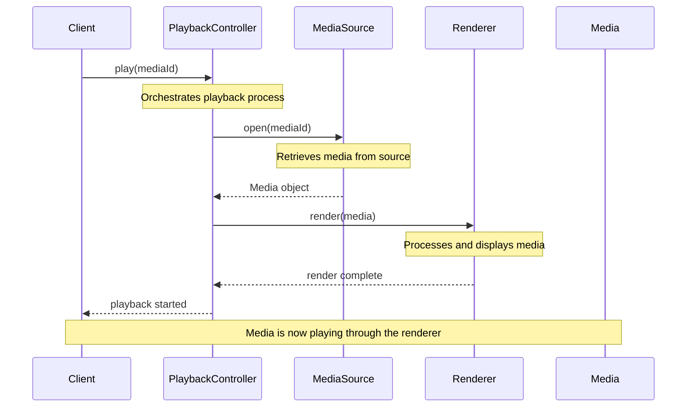
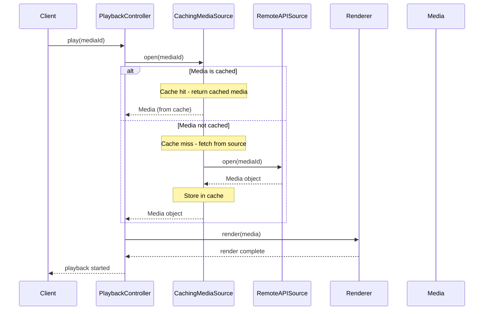
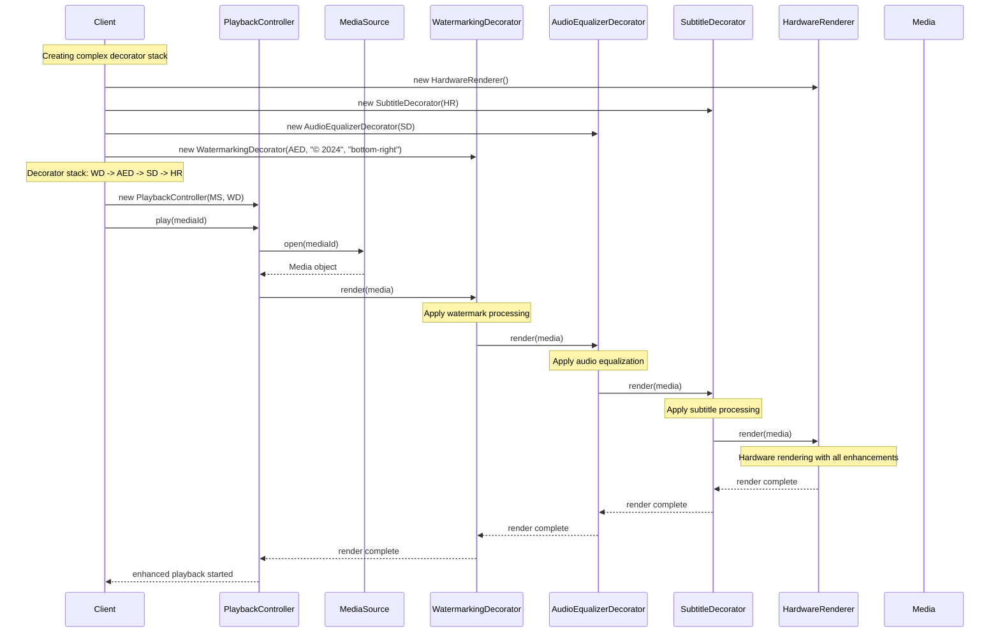
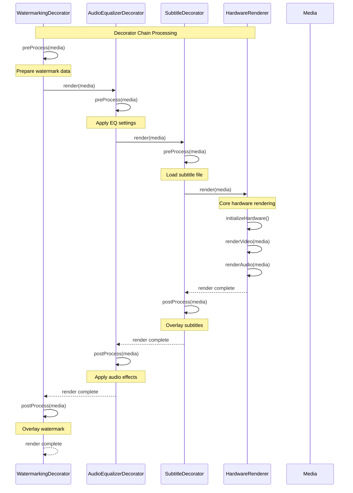
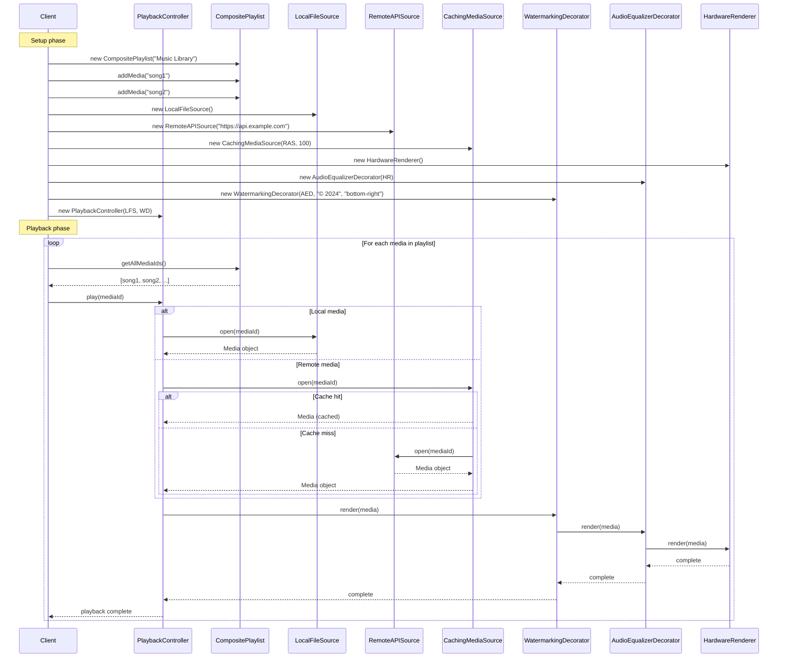

# Sequence Diagrams - Modular Media Streaming System

## Overview
This document contains sequence diagrams for the two core flows in the Modular Media Streaming System:
1. **Play Media Flow** - The basic media playback process
2. **Apply Decorator Stack Flow** - The process of applying multiple decorators to enhance rendering

---

## 1. Play Media Flow

This sequence diagram shows the complete flow when a user requests to play media through the system.

### Play Media Flow - Detailed with Caching

This enhanced version shows the flow when using a cached media source.

---

## 2. Apply Decorator Stack Flow

This sequence diagram shows how multiple decorators are applied to create an enhanced renderer with multiple features.

### Decorator Stack Flow - Step by Step

This detailed version shows the internal processing of each decorator in the stack.

---

## 3. Complete System Flow with All Components

This comprehensive sequence diagram shows the complete flow including playlist management and multiple media sources.

---

## Key Interactions Explained

### Play Media Flow
1. **Client Request**: User calls `play(mediaId)` on PlaybackController
2. **Media Retrieval**: PlaybackController requests media from MediaSource
3. **Media Processing**: MediaSource returns Media object
4. **Rendering**: PlaybackController passes Media to Renderer
5. **Playback**: Renderer processes and displays the media

### Decorator Stack Flow
1. **Stack Creation**: Decorators are chained together (outer to inner)
2. **Request Propagation**: Render request flows through each decorator
3. **Feature Application**: Each decorator adds its specific functionality
4. **Core Rendering**: Base renderer performs actual media processing
5. **Response Propagation**: Completion flows back through the stack

### Benefits of This Architecture
- **Modularity**: Each component has a single responsibility
- **Extensibility**: New decorators can be added without modifying existing code
- **Flexibility**: Different combinations of features can be applied at runtime
- **Performance**: Caching and hardware acceleration optimize playback
- **Maintainability**: Clear separation of concerns makes the system easy to understand and modify

---

## Design Pattern Applications

### Decorator Pattern
- **Purpose**: Add features dynamically without modifying existing classes
- **Implementation**: Chain decorators around base renderer
- **Benefits**: Runtime feature composition, single responsibility

### Facade Pattern
- **Purpose**: Simplify complex subsystem interactions
- **Implementation**: PlaybackController hides complexity
- **Benefits**: Single entry point, decoupled client code

### Adapter Pattern
- **Purpose**: Add caching to existing media sources
- **Implementation**: CachingMediaSource wraps other sources
- **Benefits**: Transparent performance enhancement

### Composite Pattern
- **Purpose**: Handle hierarchical playlist structures
- **Implementation**: CompositePlaylist contains media and other playlists
- **Benefits**: Uniform treatment of individual and composite objects
