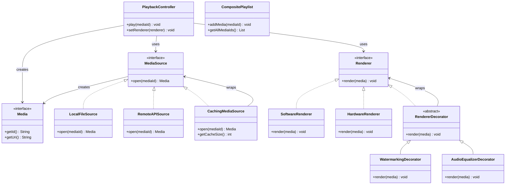

# Simplified UML Diagram - Modular Media Streaming System

## Overview
This simplified UML diagram focuses on the core components and essential relationships, making the system architecture easy to understand at a glance.

---

## Core System Architecture



---

## Simplified Design Patterns

### 1. **Decorator Pattern** 🎨
```
Base Renderer → Decorator 1 → Decorator 2 → Enhanced Renderer
```

**Example:**
```java
Renderer enhanced = new WatermarkingDecorator(
    new AudioEqualizerDecorator(
        new HardwareRenderer()
    )
);
```

### 2. **Facade Pattern** 🏢
```
Client → PlaybackController → [Complex Subsystem]
```

**Benefits:**
- Single entry point
- Hides complexity
- Easy to use

### 3. **Adapter Pattern** 🔌
```
Original Source → CachingMediaSource → Enhanced Source
```

**Benefits:**
- Adds caching transparently
- No changes to original code
- Performance boost

---

## System Flow (Simplified)

### Basic Playback
```
1. Client calls controller.play(mediaId)
2. Controller gets media from source
3. Controller renders media
4. Media plays!
```

### Enhanced Playback
```
1. Create decorator stack
2. Wrap base renderer with features
3. Play media with enhancements
4. All features applied automatically!
```

---

## Key Benefits (Simplified)

### 🎯 **Modularity**
- Each component has one job
- Easy to test and maintain
- Clear responsibilities

### 🔧 **Extensibility**
- Add new features easily
- No changes to existing code
- Runtime composition

### ⚡ **Performance**
- Smart caching
- Hardware acceleration
- Optimized rendering

### 🎨 **Flexibility**
- Mix and match features
- Runtime switching
- Dynamic composition

---

## Usage Examples (Simplified)

### Basic Setup
```java
// Simple playback
PlaybackController controller = new PlaybackController(
    new LocalFileSource(), 
    new SoftwareRenderer()
);
controller.play("video.mp4");
```

### Enhanced Setup
```java
// Enhanced playback with features
Renderer enhanced = new WatermarkingDecorator(
    new AudioEqualizerDecorator(
        new HardwareRenderer()
    )
);
PlaybackController controller = new PlaybackController(
    new CachingMediaSource(new RemoteAPISource("api.com")), 
    enhanced
);
controller.play("stream.mp4");
```

### Playlist Management
```java
// Hierarchical playlists
CompositePlaylist playlist = new CompositePlaylist("My Music");
playlist.addMedia("song1");
playlist.addMedia("song2");

// Play all media
for (String mediaId : playlist.getAllMediaIds()) {
    controller.play(mediaId);
}
```

---

## Design Principles (Simplified)

### 1. **Single Responsibility** 📋
- Each class does one thing well
- Clear purpose and scope
- Easy to understand

### 2. **Open/Closed** 🔓
- Open for extension
- Closed for modification
- Add features without changing code

### 3. **Dependency Inversion** ⬆️
- Depend on abstractions
- Not on concrete classes
- Flexible and testable

### 4. **Interface Segregation** 🎯
- Small, focused interfaces
- Only what you need
- No unnecessary dependencies

---

## Component Summary

| Component | Purpose | Key Feature |
|-----------|---------|-------------|
| **PlaybackController** | Main orchestrator | Single entry point |
| **MediaSource** | Media retrieval | Multiple sources |
| **Renderer** | Media display | Hardware/Software |
| **Decorators** | Feature addition | Runtime composition |
| **Playlists** | Media organization | Hierarchical structure |
| **Caching** | Performance boost | Transparent optimization |

---

## Why This Architecture Works

### ✅ **Easy to Understand**
- Clear component roles
- Simple relationships
- Logical flow

### ✅ **Easy to Extend**
- Add new sources
- Add new features
- Add new renderers

### ✅ **Easy to Test**
- Isolated components
- Mock dependencies
- Unit testing friendly

### ✅ **Easy to Maintain**
- Clear separation
- Minimal coupling
- High cohesion

---

## Quick Start Guide

1. **Choose your media source** (Local, Remote, Cached)
2. **Choose your renderer** (Software, Hardware)
3. **Add features** (Watermark, Audio EQ, Subtitles)
4. **Create controller** and start playing!

```java
// One-liner setup
new PlaybackController(
    new CachingMediaSource(new RemoteAPISource("api.com")),
    new WatermarkingDecorator(new HardwareRenderer())
).play("media.mp4");
```

This simplified UML focuses on the essential components and relationships, making it much easier to understand the system architecture at a glance! 🚀
