# UML Diagram - Modular Media Streaming System

## Class Diagram

```mermaid
classDiagram
    %% Core Interfaces
    class Media {
        <<interface>>
        +getId() String
        +getUri() String
    }
    
    class MediaSource {
        <<interface>>
        +open(mediaId String) Media
    }
    
    class Renderer {
        <<interface>>
        +render(media Media) void
        +supportsHardwareAcceleration() boolean
    }
    
    %% Core Classes
    class PlaybackController {
        -MediaSource source
        -Renderer renderer
        +PlaybackController(source MediaSource, renderer Renderer)
        +setRenderer(renderer Renderer) void
        +play(mediaId String) void
    }
    
    class Playlist {
        -String name
        -List~String~ items
        +Playlist(name String)
        +add(mediaId String) void
        +getItems() List~String~
        +getName() String
    }
    
    %% Media Source Implementations
    class LocalFileSource {
        +open(mediaId String) Media
    }
    
    class RemoteAPISource {
        -String apiBaseUrl
        +RemoteAPISource(apiBaseUrl String)
        +open(mediaId String) Media
    }
    
    class HLSStreamSource {
        -String baseUrl
        +HLSStreamSource(baseUrl String)
        +open(mediaId String) Media
    }
    
    class CachingMediaSource {
        -MediaSource wrapped
        -Map~String, Media~ cache
        -int maxCacheSize
        +CachingMediaSource(wrapped MediaSource, maxCacheSize int)
        +CachingMediaSource(wrapped MediaSource)
        +open(mediaId String) Media
        +clearCache() void
        +getCacheSize() int
        +isCached(mediaId String) boolean
    }
    
    %% Renderer Implementations
    class SoftwareRenderer {
        +render(media Media) void
        +supportsHardwareAcceleration() boolean
    }
    
    class HardwareRenderer {
        +render(media Media) void
        +supportsHardwareAcceleration() boolean
    }
    
    %% Decorator Pattern
    class RendererDecorator {
        <<abstract>>
        #Renderer wrapped
        +RendererDecorator(wrapped Renderer)
        +supportsHardwareAcceleration() boolean
        +render(media Media)* void
    }
    
    class SubtitleDecorator {
        +SubtitleDecorator(wrapped Renderer)
        +render(media Media) void
    }
    
    class WatermarkingDecorator {
        -String watermarkText
        -String position
        +WatermarkingDecorator(wrapped Renderer, watermarkText String, position String)
        +WatermarkingDecorator(wrapped Renderer, watermarkText String)
        +render(media Media) void
    }
    
    class AudioEqualizerDecorator {
        -String[] frequencyBands
        -int[] eqLevels
        +AudioEqualizerDecorator(wrapped Renderer)
        +setEQLevel(band int, level int) void
        +getEQLevel(band int) int
        +render(media Media) void
    }
    
    %% Composite Pattern
    class CompositePlaylist {
        -String name
        -List~Object~ items
        +CompositePlaylist(name String)
        +addMedia(mediaId String) void
        +addPlaylist(playlist CompositePlaylist) void
        +getAllMediaIds() List~String~
        +getItems() List~Object~
        +getName() String
        +getTotalMediaCount() int
    }
    
    %% Demo Class
    class EnhancedDemo {
        +main(args String[]) void
    }
    
    %% Relationships
    MediaSource <|.. LocalFileSource : implements
    MediaSource <|.. RemoteAPISource : implements
    MediaSource <|.. HLSStreamSource : implements
    MediaSource <|.. CachingMediaSource : implements
    
    Renderer <|.. SoftwareRenderer : implements
    Renderer <|.. HardwareRenderer : implements
    Renderer <|.. RendererDecorator : implements
    
    RendererDecorator <|-- SubtitleDecorator : extends
    RendererDecorator <|-- WatermarkingDecorator : extends
    RendererDecorator <|-- AudioEqualizerDecorator : extends
    
    PlaybackController --> MediaSource : uses
    PlaybackController --> Renderer : uses
    PlaybackController --> Media : creates/uses
    
    MediaSource --> Media : creates
    LocalFileSource --> Media : creates
    RemoteAPISource --> Media : creates
    HLSStreamSource --> Media : creates
    CachingMediaSource --> MediaSource : wraps
    CachingMediaSource --> Media : caches
    
    RendererDecorator --> Renderer : wraps
    SubtitleDecorator --> Renderer : wraps
    WatermarkingDecorator --> Renderer : wraps
    AudioEqualizerDecorator --> Renderer : wraps
    
    CompositePlaylist --> CompositePlaylist : contains (recursive)
    
    EnhancedDemo --> PlaybackController : uses
    EnhancedDemo --> MediaSource : creates
    EnhancedDemo --> Renderer : creates
    EnhancedDemo --> CompositePlaylist : uses
```

## Design Patterns Used

### 1. **Decorator Pattern**
- `RendererDecorator` (abstract base)
- `SubtitleDecorator`, `WatermarkingDecorator`, `AudioEqualizerDecorator`
- Allows dynamic addition of features to renderers

### 2. **Composite Pattern**
- `CompositePlaylist` can contain both media items and other playlists
- Enables hierarchical playlist structures

### 3. **Strategy Pattern**
- `MediaSource` interface with multiple implementations
- `Renderer` interface with different rendering strategies
- `PlaybackController` can switch between different sources and renderers

### 4. **Decorator Pattern (Caching)**
- `CachingMediaSource` wraps other media sources
- Adds caching functionality transparently

## Key Features

1. **Modular Architecture**: Clean separation of concerns
2. **Extensible**: Easy to add new media sources and renderers
3. **Composable**: Decorators can be chained for complex functionality
4. **Flexible**: Runtime switching between different strategies
5. **Caching**: Built-in caching support for performance
6. **Hierarchical Playlists**: Support for nested playlist structures

## Component Responsibilities

- **MediaSource**: Handles media retrieval from different sources
- **Renderer**: Handles media presentation and playback
- **PlaybackController**: Orchestrates the playback process
- **Decorators**: Add cross-cutting concerns (subtitles, watermarks, audio processing)
- **Playlists**: Manage collections of media items
- **Caching**: Optimize performance through intelligent caching
